# README-GuiaConfiguracao-InstallJenkins.md

## 1. Introdução ##

O objetivo deste guia de configuração é **Instalar do Jenkins no Windows**. 

### 2. Premissas ###

* Máquina com Sistema Operacional **Windows**
* Conexão de internet: download e instalação dos plugins sugeridos

### 3. Passo-a-passo ###

### 3.1. download do binário de instalação do Jenkins de acordo com sistema operacional (windows)  ###

[Download Jenkins - preferência LTS](https://jenkins.io/download/)

### 3.2. Configuração inicial, instalação e atualização dos plugins mais usados ###

  * descompactar o binário de instalação em um diretório

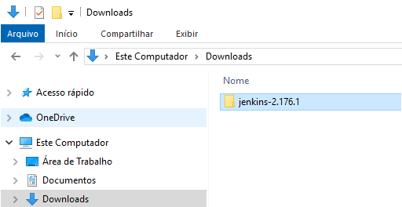

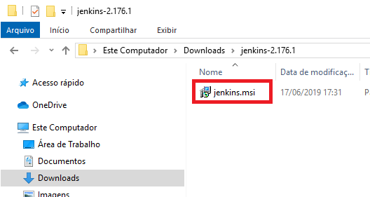
  
  * executar o binário de instalação 'jenkins.msi'

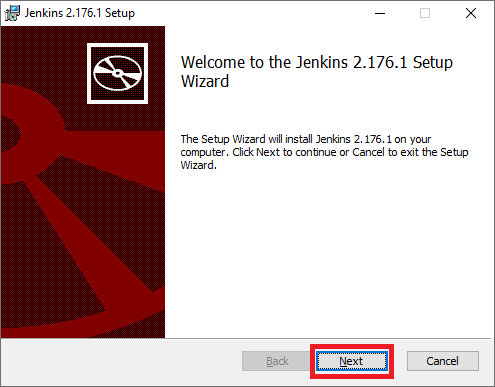

  * aceitar a sugestão do aplicativo e definir o diretório destino Ex: `C:\Program Files (x86)\Jenkins\`. Clique em `next` ... `next` até o `finish`.

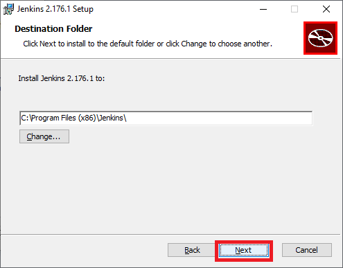

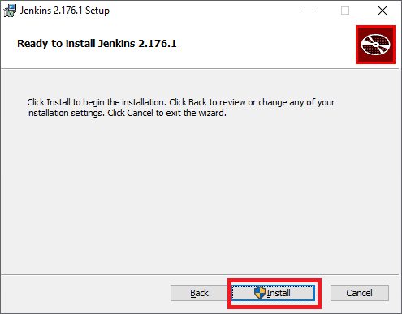

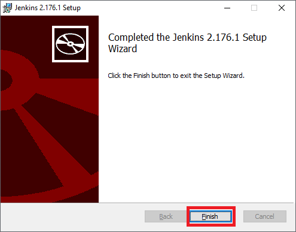

  * acesse o Jenkins pela primeira vez pelo browser
  * copie e cole no campo password o conteúdo do arquivo `C:\Program Files (x86)\Jenkins\secrets\initialAdminPassword` que contém o hash da senha do Jenkins 

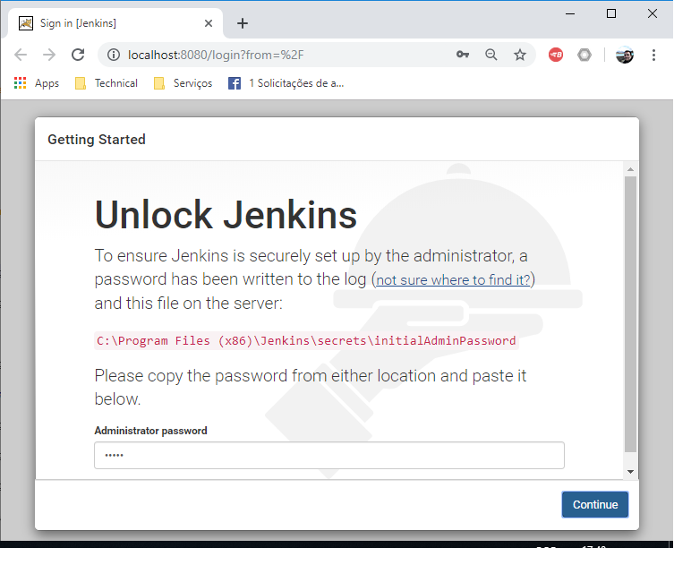

  * instale os plugins sugeridos

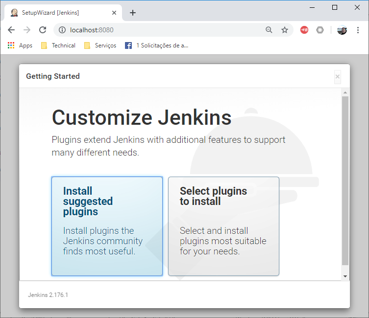

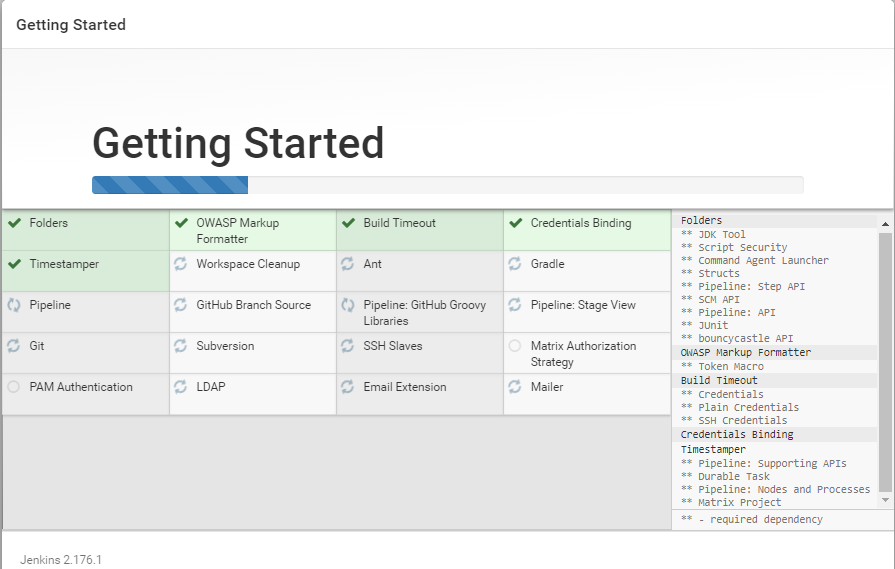

  * crie o usuário de administração

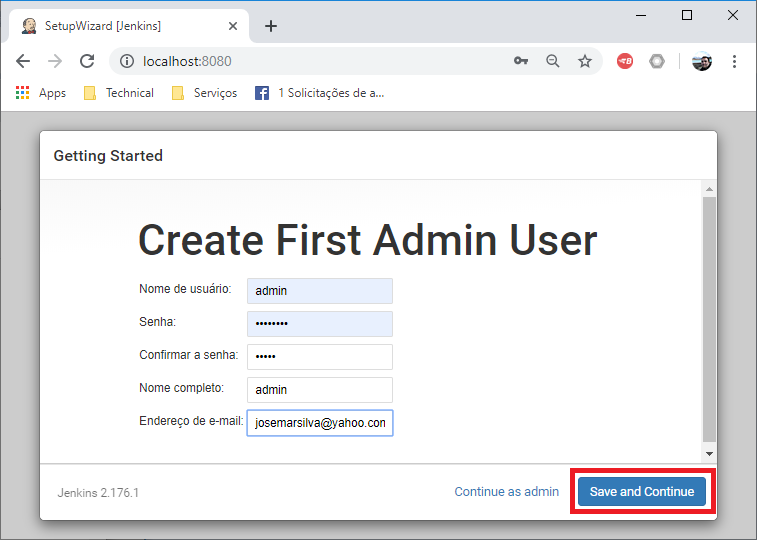

  * Configure Jenkins URL

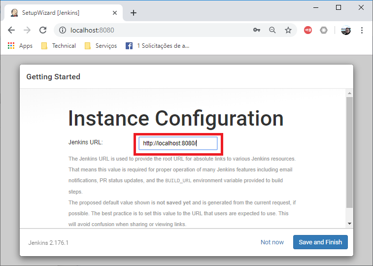

  * Pronto! Benvindo ao Jenkins

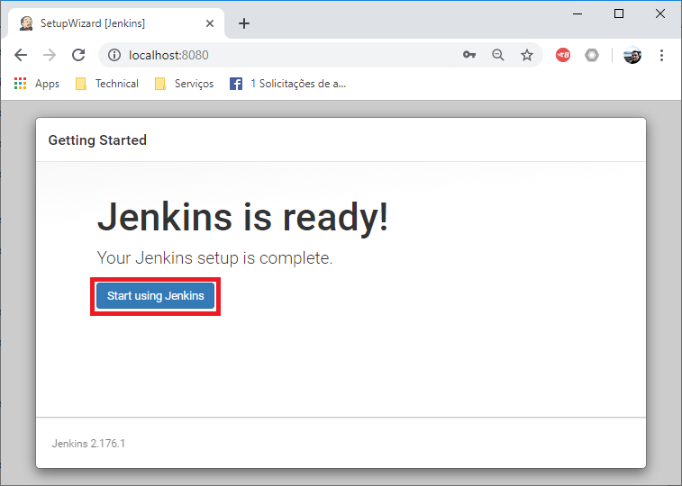

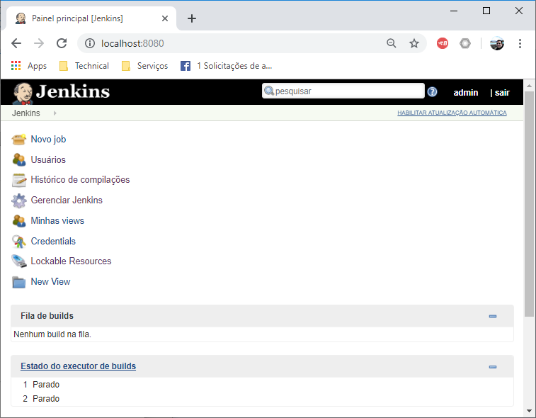

### 3.3 Entendendo como iniciar, parar e iniciar automaticamente o serviço Windows do Jenkins ###

  * Executar o comando: services.msc
  * Clicar no botão parar / iniciar conforme a operação desejada

 

## Referências ##

* n/a
