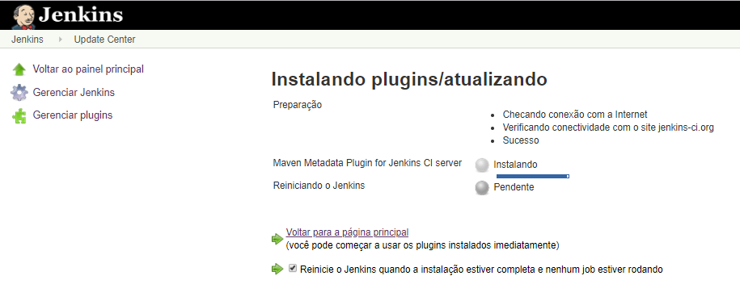
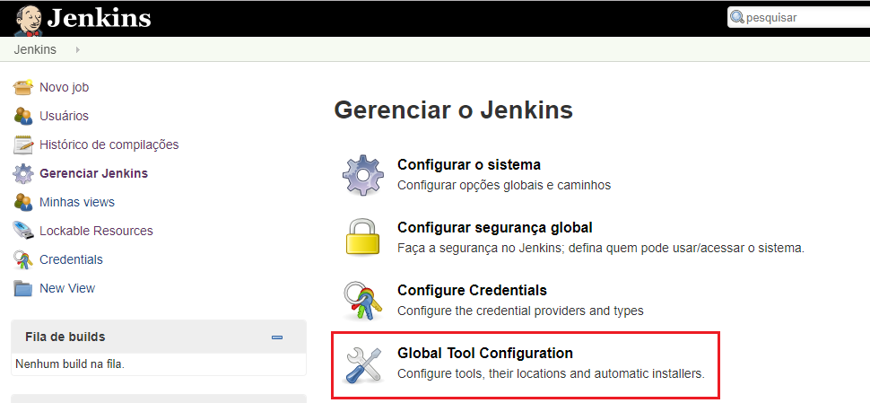
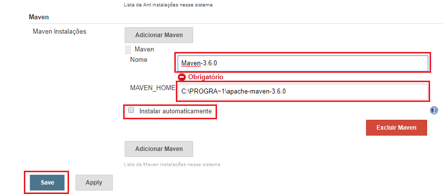

# README-GuiaConfiguracao-MavenJenkins.md

## 1. Introdução ##

O objetivo deste guia de instalação do plugin **Maven Integration** no **Jenkins**. 

### 2. Premissas ###

* n/a

### 3. Passo-a-passo ###

* Passo 1: Instalar o Plugin do **Maven Integration**

* Passo 2: A partir da instalação do Maven Integration Plugin o tipo de Job `` torna-se disponível

* Passo 3: Configurar o plugin do Maven

## Referências ##

* [Configurando Jenkins e Maven](https://www.tutorialspoint.com/jenkins/jenkins_maven_setup.htm)
* [Build Simple Maven Project in Jenkins](https://medium.com/@anusha.sharma3010/build-a-simple-maven-project-in-jenkins-da7a2a4ae202)