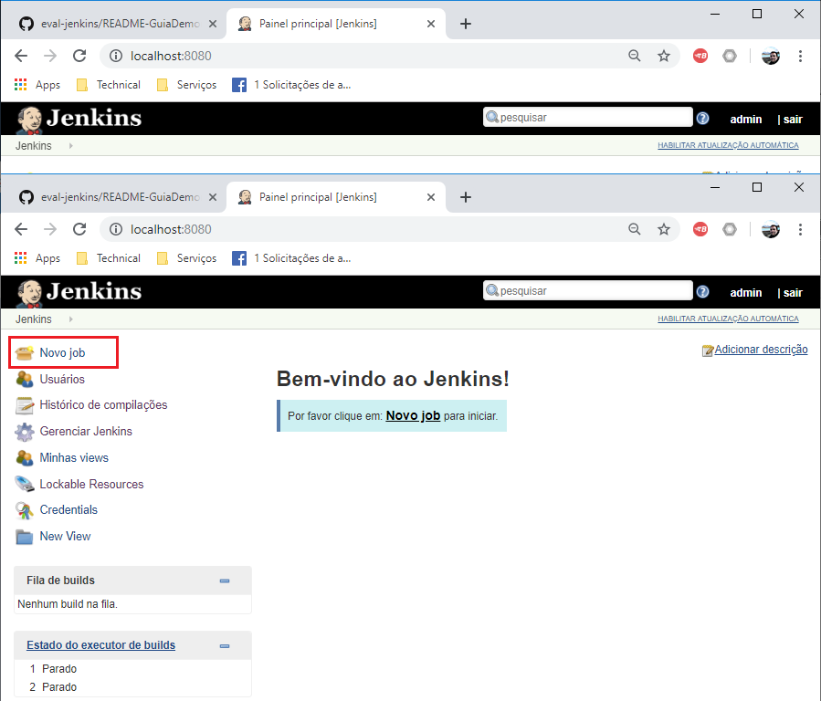
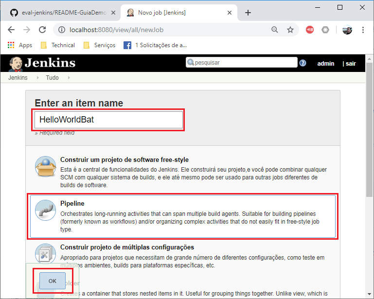
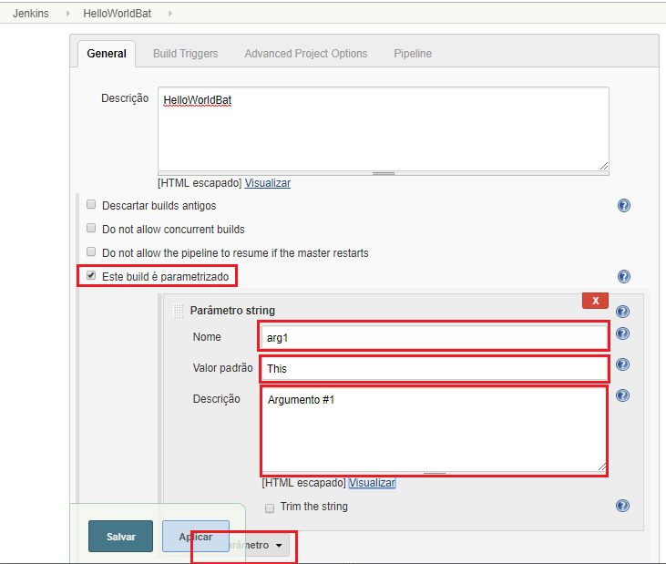
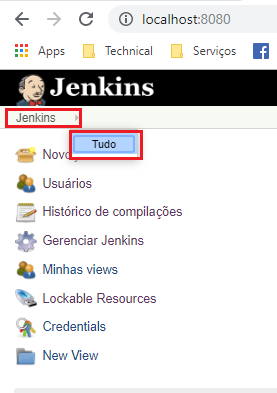
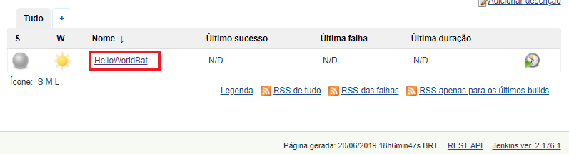
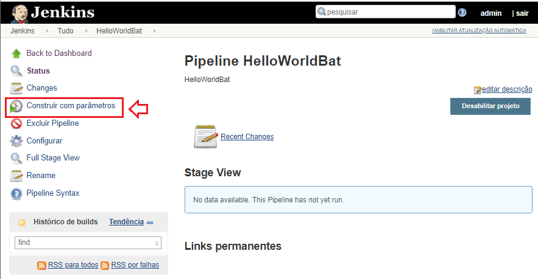

# README-GuiaDemonstracao-JobNewSimpleBatJob


## 1. Introdução ##

O objetivo desta demonstração é ensinar:
* Criar no Jenkins um novo "_Job_" do tipo "_Pipeline_" com uma atividade muito simples usando estágios do pipeline

### 2. Premissas ###

* n/a

### 3. Passo-a-passo ###

### 3.1. Criar um Script Simples (.bat) ###

* Edite um arquivo com seu script simples e salve no diretorio `%USERPROFILE%\Downloads\helloworld.bat`

```bat
@Echo Off
Echo.
Echo Hello World (.bat) - %1
Echo.
Set datefmt=%date:~-4%-%date:~3,2%-%date:~0,2%
Set timefmt=%time:~0,2%:%time:~3,2%:%time:~6,2%
Echo Current directory is 
Cd
Echo.
Echo Current DateTime is %datefmt% %timefmt%
Echo.
Echo %datefmt% ; %timefmt% >> helloworld.log
```

* Observe que este script vai escrever em um arquivo `helloworld.log` a hora corrente, assim teremos certeza de que ele executou


### 3.2. Criar um Job para executar o Script Simples (.bat) ###

* Logado no Jenkins clique na opção de menu lateral "_Jenkins >> Novo Job_"



* Preencha o novo Job com as seguintes informações e conteúdo do script groovy abaixo:
  * Enter an item Name:  `HelloWorldBat`
  * Selecione: `Pipeline`
  * Clique: `OK`
  


* Preencha as configurações do Job parametrizando-o para execução com variáveis
  * Este Job terá 5 parâmetros to tipo `string`. Primeiro você precisa clicar na opção "Este build é parametrizado" para o Jenkins habilitar o botão que cria parâmetros
  * Em seguida, para cada um dos parâmetros [ arg1, ..., arg5], você irá clicar no botão `Adicionar parâmetro`

```html
+--------------------------------------------------------------------------------+
| General                                                                        |
|   [X] Este build é parametrizado                                               |
|       [Adicionar Parametro - Parâmetro String]                                 |
|       Nome        : [ arg1         ]                                           |
|       Valor Padrão: [ This         ]                                           |
|       Descrição   : [ Argumento #1 ]                                           |
|       Nome        : [ arg2         ]                                           |
|       Valor Padrão: [ is           ]                                           |
|       Descrição   : [ Argumento #2 ]                                           |
|       Nome        : [ arg3         ]                                           |
|       Valor Padrão: [ a            ]                                           |
|       Descrição   : [ Argumento #3 ]                                           |
|       Nome        : [ arg4         ]                                           |
|       Valor Padrão: [ sample       ]                                           |
|       Descrição   : [ Argumento #4 ]                                           |
|       Nome        : [ arg5         ]                                           |
|       Valor Padrão: [ argument     ]                                           |
|       Descrição   : [ Argumento #5 ]                                           |
|                                                                                |
|   Definition: [Pipeline Script]                                                |
|   Script:     [               ] <- Script Groovy abaixo                        |
+--------------------------------------------------------------------------------+
```




* Script Groovy

```groovy
node('master'){
  stage('Initialization'){
    echo "Iniciando execução do pipeline"
  }
  stage('step1'){
    bat "C:\\Users\\Josemarsilva\\Downloads\\helloworld.bat ${env.arg1}"
  }
  stage('step2'){
    bat "C:\\Users\\Josemarsilva\\Downloads\\helloworld.bat ${env.arg2}"
  }
  stage('step3'){
    bat "C:\\Users\\Josemarsilva\\Downloads\\helloworld.bat ${env.arg3}"
  }
  stage('step4'){
    bat "C:\\Users\\Josemarsilva\\Downloads\\helloworld.bat ${env.arg4}"
  }
  stage('step5'){
    bat "C:\\Users\\Josemarsilva\\Downloads\\helloworld.bat ${env.arg5}"
  }
  stage('Finished!'){
    echo "Finished!"
  }
}
```


### 3.3. Executar o Script ###

* Logado no Jenkins clique na opção de menu lateral `Jenkins >> Tudo` Então uma lista com todos os `Jobs` será apresentada



* Clique no link que navega para o "_Job_" **HelloWorldBat** Então um formulário de detalhamento do "_Job_" será apresentado



* Clique no link do botão lateral esquerdo identificado por "Construir com parâmetros" Então um formulário de confirmação de execução com parâmetros será apresentado



* Observe que o parâmetro args está vindo com uma sugestão de valor default
* Clique no botão construir Então uma nova execução deverá aparecer no histórico de builds com a data e hora corrente

.png) 

* Clique no ícone bolinha colorida da cor (azul ou vermelho) para ver o log da console de execução

.png) 


## Referências ##

* n/a
